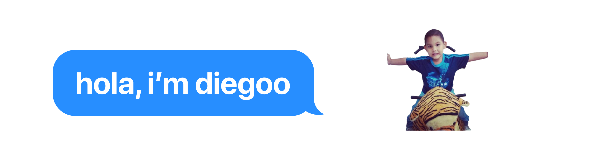

##  &nbsp; about me
 &nbsp; venezuelan boy from falcón, infp-t, meloman, 17yo, he/him  
 &nbsp; front, infra, devops, AI, math, physics @ on my own 
 &nbsp; tech/photography/music/ai

##  &nbsp; fav repos

| name | description |
|------|---------------|
| [`collweb`](https://github.com/DiegoDev2/collweb) | a beautiful websites collection |
| [`armada`](https://github.com/DiegoDev2/armada) | The reproducible security toolbox — one YAML, every platform, zero sudo |

##  &nbsp; fun fact
Most of the projects I don't finish start as spontaneous ideas at 2 a.m.

